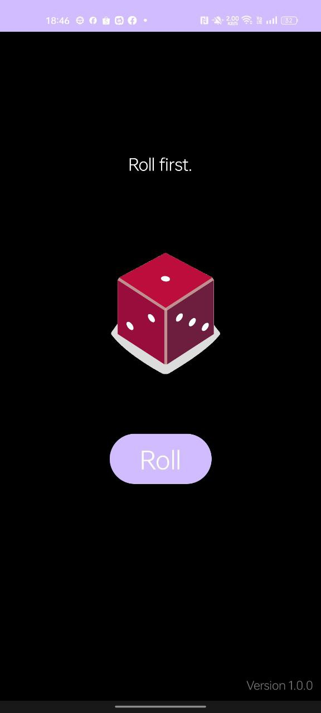
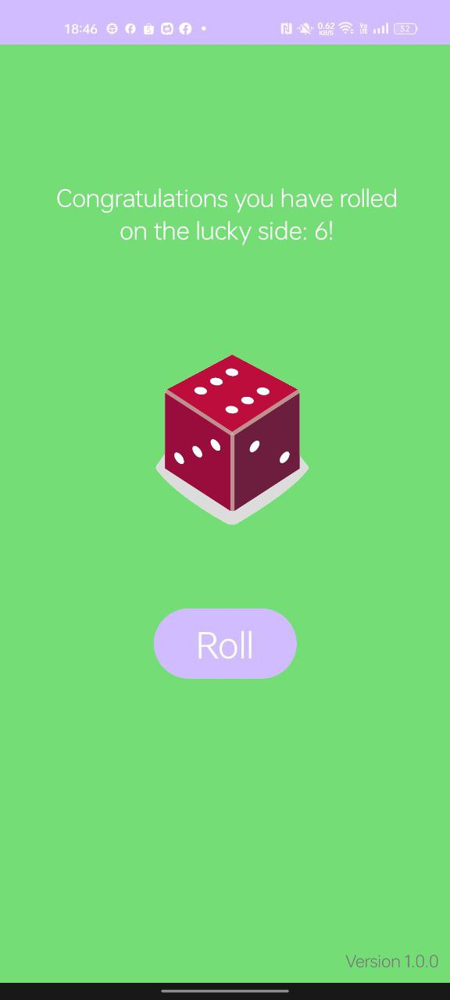
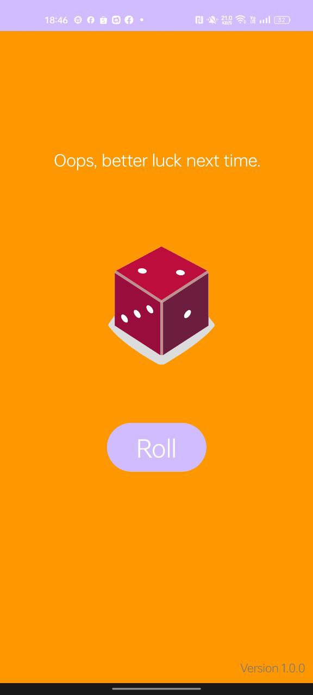
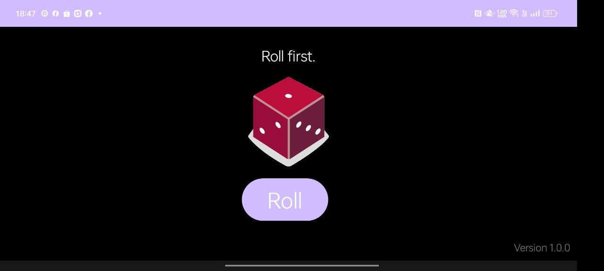
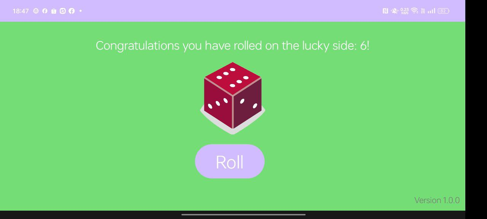
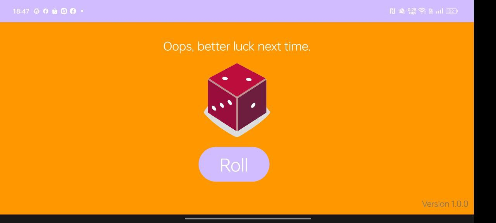

# Dice Roller - Simple App from Android Tutorial

# Description
This is a simple app made and adapted from the official tutorials provided by Android Studio, with
some additional concepts I tried to incorporate, such as

- Activity Refresh handling when screen is rotating
- Handling night and dark mode
- Creating separate layouts for landscape and portrait mode
- Added Android Icon

Note: 
Although the tutorial is done in Kotlin, I have created and followed it using Java.

# Screenshots

<table>
    <thead>
        <tr>
            <th colspan="3">Portrait</th>
        </tr>
        <tr>
            <th>Default</th>
            <th>Lucky</th>
            <th>Not Lucky</th>
        </tr>
    </thead>
    <tbody>
        <tr>
            <td></td>
            <td></td>
            <td></td>
        </tr>
    </tbody>
</table>

<table>
    <thead>
        <tr>
            <th colspan="3">Landscape</th>
        </tr>
    </thead>
    <tbody>
        <tr>
            <th>Default</th>
            <td></td>
        </tr>
        <tr>
            <th>Lucky</th>
            <td></td>
        </tr>
        <tr>
            <th>Not Lucky</th>
            <td></td>
        </tr>
    </tbody>
</table>

# Credits
Official Tutorial: https://developer.android.com/courses/pathways/android-basics-kotlin-four